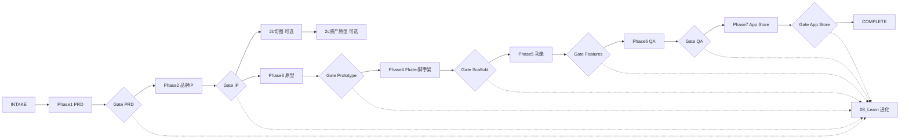

# App Workflow 全流程指南 — 独立创建 App

> 将 `00_Orchestrator/app-workflow` 七阶段串成**可执行流水线**。每个 Gate 未 PASS 不得进入下一阶段。  
> 参考实例：`healing_tabs`（云遥 / `com.nightelf.yunyao`，已至 TestFlight build 2）。

---

## 一句话启动（复制即用）

在 Cursor / Codex 对话中发送：

```text
/app-workflow 智能模式
参考：<竞品链接或名称，如 潮汐 Tide>
我想做：<一句话差异化，如 四 Tab 疗愈伴睡，原创声景与睡眠报告>
平台：iOS 优先
```

Agent 应自动：创建 `docs/workflow/<product_slug>/handoff-manifest.json` → 按 Phase 1→7 推进 → 每 Gate 跑 validator → 更新 `workflow.phase` 与 `gates.*`。

**product_slug 规则**：snake_case、ASCII，与 Flutter `--project-name` 一致（例：`healing_tabs`）。

---

## 全流程一张图



---

## 七阶段执行清单

### Phase 0 — INTAKE（编排器）

| 项 | 动作 |
|----|------|
| 技能 | `00_Orchestrator/app-workflow/SKILL.md` |
| 产出 | `docs/workflow/<slug>/handoff-manifest.json`、`glossary.md`、`adr/` |
| 验收 | `python3 00_Orchestrator/app-workflow/scripts/validate_handoff.py docs/workflow/<slug>/handoff-manifest.json` |

```bash
export APP_WORKFLOW_ROOT="$(readlink -f ~/.cursor/skills/app-workflow-root)"
cp "$APP_WORKFLOW_ROOT/00_Orchestrator/app-workflow/assets/handoff-manifest.template.json" \
   docs/workflow/<slug>/handoff-manifest.json
```

---

### Phase 1 — PRD

| 项 | 内容 |
|----|------|
| 技能 | `01_PRD/creating-app-product-docs/SKILL.md` |
| 产出 | `docs/product/YYYY-MM-DD-<名>/` 五件套（功能清单、PRD、MVP范围、sources、assumptions） |
| Gate | `python3 01_PRD/creating-app-product-docs/scripts/validate_product_docs.py docs/product/...` |
| handoff | `gates.prd = PASS`，填写 `mvp_loop`、`metadata` |

**MVP loop 必须可测**（例）：`选声景 → 睡眠会话 → 基础报告`。

---

### Phase 2 — 品牌 IP

| 项 | 内容 |
|----|------|
| 技能 | `02_IP/APP品牌IP生成/SKILL.md` |
| 产出 | `output/brand-ip/<slug>/`（Icon、启动图、04-core-tab-ui、ZIP） |
| Gate | 视觉 QA + `pack_delivery.py`；选定 Tab 方向后 `gates.ip = PASS` |
| handoff | `phases.brand.*`、`domain_docs.glossary` → `CONTEXT.md` |

**可选 2b** — 红框切图：`02_IP/regenerating-ui-redbox-assets/` → `05-ui-assets/`  
**可选 2c** — 资产 HTML 原型：`03_UI_UX/composing-asset-ui-prototype/` → `06_asset_ui/`

---

### Phase 3 — UI/UX 原型

| 项 | 内容 |
|----|------|
| 技能 | `03_UI_UX/creating-app-prototypes/SKILL.md` |
| 前置 | `gates.ip == PASS` |
| 产出 | `docs/prototype/`（追溯矩阵、交互说明、跳转图） |
| Gate | `python3 03_UI_UX/creating-app-prototypes/scripts/validate_prototype_package.py <root>` |
| 丝滑定义 | 每 P0 页在 `02-交互说明文档.md` 写清 loading/empty/error/permission/offline |

---

### Phase 4 — Flutter 脚手架

| 项 | 内容 |
|----|------|
| 技能 | `04_Dev/create-flutter-app/SKILL.md` |
| 前置 | `flutter-app-template` 存在；`gates.prototype == PASS` |
| 命令 | `create_from_template.sh` → `flutter test` → `flutter run --flavor dev` |
| Gate | `dart analyze` + `flutter test` → `gates.flutter_scaffold = PASS` |
| 编排器追加 | 复制 Phase2 Icon；`.scratch/<名>/feature-checklist.md` |

```bash
cd flutter-app-template
./scripts/create_from_template.sh ../apps/<slug> \
  --project-name <slug> --org <com.yourco> \
  --app-id <slug>_v1 --app-name "<展示名>"
```

**Playbook**：`playbooks/scaffold/ios_flavor_scheme.md`

---

### Phase 5 — 功能实现

| 项 | 内容 |
|----|------|
| 技能 | `05_Feature/implement-flutter-features/SKILL.md` |
| 产出 | `lib/features/*`、`implementation-trace.md`、feature-checklist 勾选 |
| Gate | `python3 05_Feature/implement-flutter-features/scripts/validate_feature_implementation.py <app> docs/workflow/<slug>/implementation-trace.md` |

架构约定：GetX binding → controller → page；Repository 接口在 `domain/`。

---

### Phase 6 — QA 打磨

| 项 | 内容 |
|----|------|
| 技能 | `06_QA/polish-app-quality/SKILL.md` |
| 产出 | `docs/workflow/<slug>/qa-report.md` |
| Gate | `python3 06_QA/polish-app-quality/scripts/validate_qa_report.py docs/workflow/<slug>/qa-report.md` |
| 必测 | 主路径 3 轮、状态覆盖、弱网/切后台、VoiceOver |

---

### Phase 7 — App Store

| 项 | 内容 |
|----|------|
| 技能 | `07_AppStore/release-to-app-store/SKILL.md` |
| 产出 | `app-store-submission.md`、`privacy-questionnaire.md`、`screenshots/` |
| Gate | `python3 07_AppStore/release-to-app-store/scripts/validate_app_store_package.py docs/workflow/<slug>/app-store-submission.md` |
| 一键上传 | `App/apps/<slug>/scripts/upload_app_store.sh`（见 healing_tabs 实例） |

```bash
cd App/apps/<slug>
cp .env.example .env   # 填 Team ID、API Key 路径
eval "$(mise activate bash)"
bundle install
./scripts/upload_app_store.sh
```

---

### Phase ∞ — 进化（每 Gate 后）

```bash
python3 08_Learn/evolve-workflow/scripts/log_repetition.py \
  --phase <phase> --pattern "..." --context "..." --product-slug <slug>
# count≥3 → promote_to_playbook.py
```

索引：`00_Orchestrator/app-workflow/playbooks/INDEX.md`

---

## 领域词汇（Workflow 本体）

| 术语 | 定义 |
|------|------|
| **product_slug** | 文件系统安全的产品 ID，贯穿 handoff、Flutter 工程名、`output/brand-ip/` |
| **handoff-manifest** | 单源真相 JSON；`workflow.phase` + `gates.*` + 各阶段路径 |
| **Gate** | 脚本 validator 输出 `PASS` 才可晋级 |
| **mvp_loop** | 一句可验收闭环，PRD 与 QA 主路径对齐 |
| **视觉契约** | `04-core-tab-ui` 锁定布局/Tab 顺序，Flutter 用 `HealingLayout` 等比缩放 |
| **追溯矩阵** | 原型需求行 ↔ `implementation-trace.md` 代码路径 |
| **defer** | MVP 外显式延期项，须写入 qa-report 与审核备注 |

产品域词汇写在 `output/brand-ip/<slug>/CONTEXT.md`（非实现细节）。

---

## Grill 首轮 — 下一 App 开工前必答

> 设计树前沿：以下决策未定时，不要开 Phase 4+。

❓ **Q1 - Bundle ID 与账号归属**：新 App 用新 Bundle ID 还是复用已有（如 `com.nightelf.yunyao`）？Apple Team、App Store Connect 记录是否已创建？

➡️ **推荐**：每个独立产品一个新 Bundle ID；在 `instance.config.yaml` / `.env` / `pbxproj` **三处同源**，避免 match 与 Xcode 不一致。

---

❓ **Q2 - 上架策略**：首版仅 TestFlight 内测，还是直接提审？是否接订阅（StoreKit）？

➡️ **推荐**：MVP 先 TestFlight + 游客模式闭环；订阅标 defer，避免审核卡付费墙。

---

❓ **Q3 - 音频与合规**：是否播放远程 HTTP 音频？是否声明麦克风（即使用户不录音）？

➡️ **推荐**：远程 CDN 需 ATS 例外 + 隐私说明；`audio_session` 必须加 `NSMicrophoneUsageDescription`（healing_tabs 已被 Apple 拒过 build 1）。

---

❓ **Q4 - 发布流水线**：本机 fastlane 还是 CI tag 触发？证书用 match 还是 Xcode 自动签名？

➡️ **推荐**：首版 `SKIP_MATCH=true` + `ExportOptions.automatic.plist`；match 需**独立证书 git 仓库** + SSH，不要用代码仓库 URL。

---

❓ **Q5 - Ruby/构建环境**：是否固定 mise Ruby 3.3+？

➡️ **推荐**：项目根加 `.ruby-version`；`upload_app_store.sh` 内 `mise activate`，避免系统 Ruby 2.6 编译 json gem 失败。

---

## 文件契约总览

```
docs/workflow/<slug>/
├── handoff-manifest.json      # 状态机
├── implementation-trace.md    # Phase 5
├── qa-report.md               # Phase 6
├── app-store-submission.md    # Phase 7
├── privacy-questionnaire.md
└── screenshots/

docs/product/YYYY-MM-DD-<名>/   # Phase 1
docs/prototype/                 # Phase 3
output/brand-ip/<slug>/         # Phase 2
App/apps/<slug>/                # Phase 4–7
```

---

## 常用命令速查

```bash
# 校验 handoff
python3 00_Orchestrator/app-workflow/scripts/validate_handoff.py \
  App/docs/workflow/<slug>/handoff-manifest.json

# 本地 dev
cd App/apps/<slug>
flutter run --flavor dev --dart-define-from-file=dart_defines.dev.json

# 本地 prod IPA
flutter build ipa --flavor prod --dart-define=APP_VARIANT=prod \
  --dart-define-from-file=dart_defines.prod.json \
  --export-options-plist=ios/ExportOptions.automatic.plist

# 上传 TestFlight
./scripts/upload_app_store.sh

# 打 tag 触发 CI（若配置 GHA）
git tag v0.1.0 && git push origin v0.1.0
```

---

## 与「一句话搞定」的关系

| 你想做的 | 发送给 Agent |
|----------|----------------|
| 从零做新 App | 上文「一句话启动」模板 |
| 只做某一阶段 | `/implement-flutter-features` 或 `进入 Phase 7` |
| 修审核拒信 | 贴 Apple 邮件 + `继续 Phase 7` |
| 沉淀重复步骤 | `记录到 evolve-workflow` 或第三次自动晋升 Playbook |

**Agent 不应跳过 Gate**；用户说「继续下一轮」= 进入下一 `workflow.phase` 并执行对应子技能全文。

---

## 延伸阅读

- [healing_tabs-复盘补缺.md](./healing_tabs-复盘补缺.md) — 首个完整实例的摩擦清单
- `00_Orchestrator/app-workflow/playbooks/INDEX.md` — 已晋升 Playbook
- `08_Learn/evolve-workflow/SKILL.md` — 规则之三
