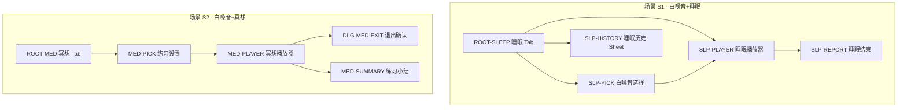

# 睡眠与冥想 V1 — 页面划分与 Codex 出图简报

- PRD：`04-睡眠与冥想-V1.md`
- 画布：**941 × 1672**（9:16），与 `04-core-tab-ui` 一致
- 底栏：四 Tab 固定 `首页 → 睡眠 → 冥想 → 声音`（根 Tab 页沿用已有参考图，本文件只列 **V1 新增/改版** 页面）

---

## 1. 页面地图



---

## 2. 页面总表

| 页面 ID | 中文名 | 类型 | 场景 | 路由/呈现 | 设计基准 JSON | 已有参考图 |
|---|---|---|---|---|---|---|
| ROOT-SLEEP | 睡眠 Tab | 根 Tab | S1 | Tab index 1 | `design-system-profile-sleep.json` | `sleep-tab-v1.png` ✅ |
| ROOT-MED | 冥想 Tab | 根 Tab | S2 | Tab index 2 | `design-system-profile-meditation.json` | `meditation-tab-v2.png` ✅ |
| SLP-PICK | 白噪音选择 | 全屏/Sheet | S1 | modal | `design-system-profile-sleep.json` | 需生成 |
| SLP-PLAYER | 睡眠沉浸播放器 | 全屏 | S1 | `/player/:id?scenario=sleep` | `design-system-profile-sleep.json` | 需生成 |
| SLP-REPORT | 睡眠结束 | 全屏 | S1 | `/sleep/report` | `design-system-profile-sleep.json` | 需生成 |
| SLP-HISTORY | 睡眠历史 | Bottom Sheet | S1 | sheet | `design-system-profile-sleep.json` | 需生成 |
| MED-PICK | 练习设置 | Bottom Sheet | S2 | modal | `design-system-profile-meditation.json` | 需生成 |
| MED-PLAYER | 冥想沉浸播放器 | 全屏 | S2 | `/player/:id?scenario=meditation` | `design-system-profile-meditation.json` | 需生成 |
| MED-SUMMARY | 练习小结 | 全屏 | S2 | `/meditation/summary` | `design-system-profile-meditation.json` | 需生成 |
| DLG-MED-EXIT | 退出确认 | Dialog | S2 | overlay | `design-system-profile-meditation.json` | 需生成 |

**输出目录建议：**

```
output/brand-ip/healing_tabs/04-core-tab-ui/v1-screens/
├── design-system-profile-slp-pick.json
├── …（每页一份 profile，可由 Codex Step A 从参考 Tab 派生）
├── slp-pick-v1.png
├── slp-player-v1.png
└── …
```

---

## 3. 共享设计 Token（出图必带）

从 `design-system-shared.json` + 各 Tab profile 继承：

| Token | 睡眠系 (S1) | 冥想系 (S2) |
|---|---|---|
| 背景 | 月夜山湖摄影 + 暗色遮罩 | 雾白天空 + 远山 |
| 玻璃面板 | `rgba(22,28,36,0.52)` blur 24 | `rgba(255,255,255,0.62)` blur 24 |
| 主强调色 | `#B0A4FF` 薰衣草 | `#E6A23C` 琥珀 |
| 标题字号 | 36px bold | 36px bold dark |
| 底栏 | 浮动胶囊 861×88，y=1502 | 同上（浅色玻璃） |
| 圆角 | 卡片 22–26px，pill 999 | 卡片 20–22px |

---

## 4. 逐页设计说明 + Codex 出图 Prompt

> **Pipeline（每页）**  
> 1. **Step A**：附上本页「结构说明」+ 对应 Tab 参考图 → 生成 `design-system-profile-<page>.json`（不含文案）  
> 2. **Step B**：附上 Tab 参考图 + JSON + 下方 **Image Prompt** → 生成 `941×1672` PNG  

---

### ROOT-SLEEP · 睡眠 Tab（已有，V1 微调）

**结构（在 `sleep-tab-v1.png` 基础上）：**

- Hero 区「月光入梦」播放钮 → 进入 `SLP-PLAYER`（默认声景）
- Feature tray 第一项「睡眠故事」改为 **「白噪音」** → 进入 `SLP-PICK`
- 右上角或 Hero 下增加 **「昨夜小结」** 文字链 → `SLP-HISTORY`

**Codex 微调 Prompt（image2，参考 `sleep-tab-v1.png`）：**

```
Mobile app UI, 941x1672, 9:16 portrait, healing sleep app dark theme.
Match the reference image layout exactly: moonlit lake hero, lavender play button,
three-card feature tray, floating bottom tab bar (首页/睡眠/冥想/声音) with 睡眠 active.

Changes only:
- Middle feature tray card label: 白噪音 (instead of generic label)
- Small text link below hero metadata: 昨夜小结
Keep glassmorphism, Chinese typography, no Tide branding, no English clutter.
Photorealistic background, frosted glass cards, soft purple accent glow on active tab.
```

---

### ROOT-MED · 冥想 Tab（已有，V1 微调）

**结构：**

- 2×2 网格卡片均可进入 `MED-PICK`（V1 不区分课程，仅装饰图不同）
- 引言卡保持不变

**Codex 微调 Prompt（参考 `meditation-tab-v2.png`）：**

```
Mobile app UI, 941x1672, light airy meditation theme, match reference layout.
Quote card with leaf illustration, section 为心出发, 2x2 category image cards,
floating light glass bottom tab bar with 冥想 active amber glow.

No layout change; ensure grid cards look tappable for single practice sessions.
Warm mist white background, dark text #2C3338, amber accent #E6A23C.
Chinese labels only. No competitor logos.
```

---

### SLP-PICK · 白噪音选择

**结构：**

| 区域 | 内容 |
|---|---|
| 顶栏 | 返回、标题「选择白噪音」 |
| 列表 | 3 行卡片：图标 + 名称 + 标签 pill（雨声/自然）+ 播放预览钮 |
| 底栏 | 四 Tab，睡眠激活 |

**布局槽位（941 画布）：**

- 标题 y≈120；列表 y≈200，行高≈120，间距 16；左右 margin 40

**Codex Image Prompt：**

```
Mobile app UI screen 941x1672, dark healing sleep theme, full page list picker.

Layout:
- Top: back chevron left, title 选择白噪音 (36px bold white) at y=120
- Scroll list of 3 glass cards (861w, 120h, radius 22, margin 40):
  1) 山谷雨声 · tags 自然 雨声 · small circular play icon right
  2) 海边浪声 · tags 自然 海浪
  3) 林间风声 · tags 自然 风声
- Full-bleed dark misty forest photographic background with blue-green grade
- Floating bottom tab bar: 首页 睡眠 冥想 声音 — 睡眠 tab lavender glow active
- Frosted glass cards rgba(22,28,36,0.55), subtle white border
- No meditation course UI, no mixer sliders, Chinese only
```

**Step A JSON 文件名：** `design-system-profile-slp-pick.json`

---

### SLP-PLAYER · 睡眠沉浸播放器

**结构：**

| 区域 | 内容 |
|---|---|
| 背景 | 全屏暗色声景图（可模糊当前声景） |
| 顶栏 | 下拉关闭、声景名、收藏占位 |
| 中央 | 大号圆形播放/暂停（薰衣草光晕） |
| 下部玻璃卡 | 睡眠定时器：15/30/45/60 chips + 自定义 |
| 主 CTA | 宽按钮「开始睡觉」（未开始时）；进行中改为「结束睡眠」 |
| 状态条 | 已开始睡觉时：小字「睡眠记录中 · 00:42」 |

**Codex Image Prompt：**

```
Mobile immersive player UI 941x1672, dark night sleep scenario, portrait.

Layout:
- Full screen moody rain-on-window or mountain night photo background, dark overlay 40%
- Top: down arrow dismiss left, center title 山谷雨声, star outline right
- Center: large circular play/pause button 120px with soft lavender outer glow #B0A4FF
- Bottom glass panel (861w, radius 26, y~1180):
  - Section label 睡眠定时器
  - Horizontal chips: 15分 30分 45分 60分 (one selected filled lavender)
  - Primary pill button full width: 开始睡觉 (white text on lavender gradient)
- Subtle waveform line above bottom panel
- NO bottom tab bar on this full-screen page
- Low light, eye-comfort, Chinese labels, frosted glass, wellness app not music streaming UI
```

**Step A JSON：** `design-system-profile-slp-player.json`

---

### SLP-REPORT · 睡眠结束

**结构：**

| 区域 | 内容 |
|---|---|
| 顶栏 | 标题「睡得很好」或「本次睡眠」 |
| 主数字 | 在床时长 `6小时24分` |
| 副文案 | 关联声景名 |
| 评分 | 5 个空心星或 1–5 圆点 |
| CTA | 「完成」主按钮；次按钮「查看历史」 |

**Codex Image Prompt：**

```
Mobile app screen 941x1672, dark sleep theme completion page.

Layout:
- Dark blue-night gradient background, soft aurora, minimal
- Center top: gentle headline 本次睡眠 (24px)
- Large duration display 6小时24分 (48px white, centered)
- Subtitle 伴睡声景：山谷雨声 (muted #9AA0B9)
- 5 star rating row, 3 filled lavender, caption 睡得怎么样？（可选）
- Bottom primary button 完成 (lavender, radius 999, margin 40)
- Secondary text button 查看历史
- Calm, rewarding, no medical claims, Chinese only
```

---

### SLP-HISTORY · 睡眠历史 Sheet

**结构：**

- 半透明遮罩 + 上圆角 Sheet（高度约 60%）
- 标题「睡眠记录」
- 3 条历史：日期 | 时长 | 声景 | 星级

**Codex Image Prompt：**

```
Mobile UI 941x1672, dark theme, bottom sheet overlay on blurred sleep tab background.

Bottom sheet (~1000px tall) with top radius 28, glass dark panel:
- Handle bar centered top
- Title 睡眠记录 (20px bold)
- List rows separated by hairlines:
  · 8月30日  6小时24分  山谷雨声  ★★★★☆
  · 8月29日  7小时02分  海边浪声  ★★★☆☆
  · 8月28日  5小时48分  林间风声  ★★★★★
Background dimmed sleep tab visible behind sheet.
Chinese, minimal, no charts or sleep stage graphs.
```

---

### MED-PICK · 练习设置

**结构：**

| 区域 | 内容 |
|---|---|
| Sheet 顶 | 主题名「减压放松」（来自卡片） |
| 声景 | 单行：当前白噪音 + 更换 |
| 时长 | 3 个大 chip：5 / 10 / 15 分钟 |
| CTA | 「开始练习」琥珀色主按钮 |

**Codex Image Prompt：**

```
Mobile UI 941x1672, light meditation theme, bottom sheet practice setup.

Sheet on pale sky background (meditation tab blurred behind):
- Title 减压放松 (from category card)
- Row 背景音景：山谷雨声 › 
- Section 练习时长
- Three large selectable chips in a row: 5分钟 10分钟 15分钟 (10分钟 selected amber border #E6A23C)
- Full width CTA button 开始练习 (amber fill, white text, radius 999)
- Light frosted glass sheet, dark text #2C3338, leaf motif subtle corner decoration
- Chinese only, no course curriculum list, no instructor photo
```

---

### MED-PLAYER · 冥想沉浸播放器

**结构：**

| 区域 | 内容 |
|---|---|
| 背景 | 浅色雾霭 + 极淡山影 |
| 顶栏 | 关闭、剩余时间 `08:32` |
| 中央 | **呼吸圆环**（外圈缩放动画示意：吸气大/呼气小） |
| 中部文案 | 「吸气」或「呼气」 |
| 底栏 | 暂停钮；白噪音名小字 |
| 无 Tab 栏 |

**Codex Image Prompt：**

```
Mobile immersive meditation player 941x1672, light airy theme, portrait.

Layout:
- Soft white-mist photographic background, very low contrast mountains
- Top: X close left, remaining time 08:32 right (dark text)
- Center: large breathing ring circle (double stroke amber #E6A23C), slightly expanded state labeled 吸气
- Below ring: subtitle 跟随节奏，慢慢呼吸
- Bottom center: circular pause button on light glass
- Tiny caption 背景：山谷雨声
- NO bottom navigation tab bar
- Calm, minimal, no guru portrait, no voice waveform, Chinese wellness app
```

---

### MED-SUMMARY · 练习小结

**结构：**

| 区域 | 内容 |
|---|---|
| 插画 | 小叶子或光晕（轻量） |
| 标题 | 「练习完成」 |
| 时长 | `10分钟` |
| 情绪 | 3 个圆形图标+标签：平复 / 放松 / 仍有杂念（中间选中） |
| CTA | 「完成」 |

**Codex Image Prompt：**

```
Mobile screen 941x1672, light meditation completion summary.

Layout:
- Pale gradient background consistent with meditation tab
- Top illustration: small green leaf cluster, soft glow
- Headline 练习完成 (28px dark)
- Large duration 10分钟 (44px)
- Question 现在感觉如何？
- Three emotion options in a row (icon + label):
  平复 | 放松 (selected amber ring) | 仍有杂念
- Bottom primary button 完成 (amber)
- Positive, non-clinical, Chinese only, no streak calendar, no share card
```

---

### DLG-MED-EXIT · 退出确认（对话框）

**结构：**

- 冥想播放器背景模糊
- 居中对话框：文案「确定结束本次练习？」
- 按钮：继续练习 | 结束

**Codex Image Prompt：**

```
Mobile UI 941x1672, meditation player blurred in background, centered alert dialog.

Dialog card white glass 320w radius 20:
- Message 确定结束本次练习？
- Two buttons horizontal: 继续练习 (text) | 结束 (amber filled)
Light theme, subtle shadow, Chinese only, small modal not full screen.
```

---

## 5. Codex 批量出图命令清单（复制执行）

在 Cursor / Codex 中对每页执行：

```text
1. 读取 output/brand-ip/healing_tabs/04-core-tab-ui/design-system-profile-sleep.json（或 meditation）
2. Step A：根据 §4 结构说明生成 design-system-profile-<page>.json → 存入 v1-screens/
3. Step B：image2 生成 941x1672 PNG，参考对应 Tab 的 core-tab-ui PNG + 新 JSON
4. 命名：<page-id>-v1.png，例如 slp-player-v1.png
```

| 序号 | 输出文件 | 参考图 |
|---|---|---|
| 1 | `slp-pick-v1.png` | `sleep-tab-v1.png` |
| 2 | `slp-player-v1.png` | `sleep-tab-v1.png` |
| 3 | `slp-report-v1.png` | `sleep-tab-v1.png` |
| 4 | `slp-history-v1.png` | `sleep-tab-v1.png` |
| 5 | `med-pick-v1.png` | `meditation-tab-v2.png` |
| 6 | `med-player-v1.png` | `meditation-tab-v2.png` |
| 7 | `med-summary-v1.png` | `meditation-tab-v2.png` |
| 8 | `dlg-med-exit-v1.png` | `meditation-tab-v2.png` |

---

## 6. 与 Flutter 路由对照

| 页面 ID | GetX 路由 |
|---|---|
| SLP-PLAYER | `/player/:soundId` + `scenario=sleep` |
| SLP-REPORT | `/sleep/report` |
| MED-PLAYER | `/player/:soundId` + `scenario=meditation` |
| MED-SUMMARY | `/meditation/summary` |
| SLP-PICK / MED-PICK | `showModalBottomSheet` 或 `Get.bottomSheet` |
| SLP-HISTORY | `showModalBottomSheet` |
| DLG-MED-EXIT | `Get.dialog` |

---

## 7. 验收（出图）

- [ ] 全部 PNG 为 **941×1672**，无拉伸
- [ ] S1 页面暗色系 + 薰衣草强调；S2 浅色系 + 琥珀强调
- [ ] 全屏播放器页 **无底部四 Tab**
- [ ] 根 Tab 页出图保留四 Tab 且顺序正确
- [ ] 无医疗诊断、无睡眠分期图、无多轨混音 UI
