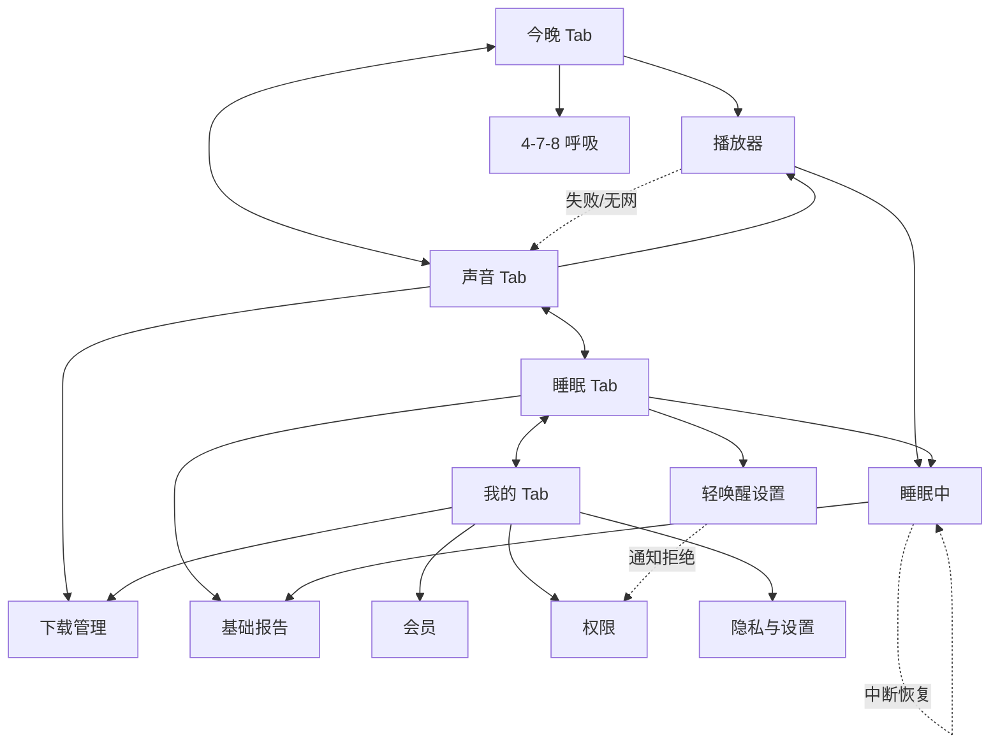

# 松息页面跳转逻辑图

```mermaid
flowchart TD
  Tonight["今晚 Tab"] --> Player["播放器"]
  Tonight --> Breath["4-7-8 呼吸"]
  Sounds["声音 Tab"] --> Player
  Sounds --> Downloads["下载管理"]
  Player --> Session["睡眠中"]
  Sleep["睡眠 Tab"] --> Session
  Sleep --> Alarm["轻唤醒设置"]
  Sleep --> Report["基础报告"]
  Session --> Report
  Profile["我的 Tab"] --> Paywall["会员"]
  Profile --> Downloads
  Profile --> Permissions["权限"]
  Profile --> Privacy["隐私与设置"]
  Tonight <--> Sounds
  Sounds <--> Sleep
  Sleep <--> Profile
  Player -. "失败/无网" .-> Sounds
  Alarm -. "通知拒绝" .-> Permissions
  Session -. "中断恢复" .-> Session
```

## 返回规则

- 详情关闭：回到打开该详情的根页。
- 播放器返回：播放继续时显示迷你播放状态；未播放时直接返回。
- 睡眠中返回：会话继续，根页显示恢复入口。
- 报告完成：回到睡眠 Tab，并刷新最近记录。
- 付费墙关闭/失败：回到原页且不改变免费用户的闭环状态。

