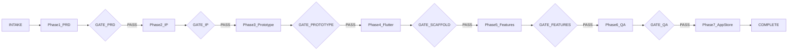

# App Workflow — 从想法到 App Store 的 AI 流水线

把一句话产品意图，编排成 **七个可验证阶段 + 持续进化环**。每个阶段只向下游传递**文件契约**，不靠聊天记忆串联；任一质量门未 `PASS`，不得进入下一阶段。

> 权威编排逻辑见 [`00_Orchestrator/app-workflow/SKILL.md`](00_Orchestrator/app-workflow/SKILL.md)。本文是其人类友好版上手指南。

---

## 这是什么

App Workflow 是一套在 Cursor / Codex 中运行的 **Agent 技能流水线**，帮你完成：

```
产品定义 → 品牌 IP → UI 原型 → Flutter 脚手架 → 功能实现 → QA 打磨 → App Store 提审
```

核心原则：

- **先研究再生成** — 不跳过 PRD 直接画图或写代码
- **一条 MVP 闭环** — 每个 App 只验证一个可测试的价值循环
- **文件契约串联** — 阶段之间靠 `handoff-manifest.json` 和产物目录传递，不靠聊天记忆
- **质量门强制** — 每个阶段有 validator 脚本，必须打印 `PASS` 才算完成

---

## 开始前准备

### 工具

| 工具 | 用途 | 何时需要 |
|------|------|---------|
| [Cursor](https://cursor.com) 或 Codex | 运行 Agent 技能 | 全程 |
| Python 3 | 运行各阶段 validator | Phase 1 起 |
| Flutter SDK | 脚手架、功能、QA | Phase 4 起 |
| Xcode（iOS 优先时） | 真机调试、TestFlight | Phase 4 起 |
| Apple Developer 账号 | 上架 | Phase 7 |

### 安装技能

在本仓库根目录执行：

```bash
bash 00_Orchestrator/app-workflow/scripts/install_skills.sh all
```

安装后：

- **Cursor**：在聊天框输入 `/app-workflow` 启动总编排
- **Codex**：输入 `$app-workflow`（下一轮对话生效）
- `~/.cursor/skills/app-workflow-root` 会软链接到本仓库，校验脚本从此处调用

若只装一端：

```bash
bash 00_Orchestrator/app-workflow/scripts/install_skills.sh cursor   # 仅 Cursor
bash 00_Orchestrator/app-workflow/scripts/install_skills.sh codex    # 仅 Codex
```

在其他项目工作区运行校验脚本时，先设置：

```bash
export APP_WORKFLOW_ROOT="$(readlink -f ~/.cursor/skills/app-workflow-root)"
cd "$APP_WORKFLOW_ROOT"
```

---

## 30 秒启动：你要填什么

复制下面模板，改填你的内容，粘贴到 Cursor / Codex 聊天框：

```text
/app-workflow 智能模式
参考：<竞品 App Store 链接或名称>
我想做：<一句话差异化>
平台：<iOS 优先 | 双端 | Android 优先>
```

**示例：**

```text
/app-workflow 智能模式
参考：潮汐 Tide（https://apps.apple.com/cn/app/id1077776989）
我想做：睡前心率+呼吸辅助的轻冥想 App
平台：iOS 优先
```

Agent 收到后会：

1. 创建 `App/docs/workflow/<product_slug>/handoff-manifest.json`
2. 推断 `product_slug`（snake_case，如 `yunyao_sleep`）
3. 把所有推断写入 `assumptions.md`，供你核对

---

## 两种模式

若启动时**未指定模式**，Agent 必须问你一次，不要静默选择：

| 模式 | 适合谁 | 行为 |
|------|--------|------|
| **A. 智能模式** | 想快速出结果 | 最多问 3 个关键问题，其余保守推断，一次性产出 |
| **C. 深度访谈模式** | 复杂/高风险产品 | 逐项确认定位、功能架构、合规、商业模式后再产出 |

从智能模式切换到深度访谈时，已确认的事实会保留在 `assumptions.md` 和 `handoff-manifest.json` 中。

---

## 全流程一览



**规则：每个 Gate 必须 `PASS` 才能进入下一阶段。** 可选阶段 2b（切图）和 2c（资产合成）不阻塞主流程，但建议在 Phase 3 前完成以提前发现视觉资产缺口。

每通过一个 Gate，流水线会自动执行 **进化回顾**（`evolve-workflow`），把重复摩擦沉淀为 Playbook。

---

## 七个阶段逐步教程

每个阶段包含四块：**何时用 → 输入 → 产出 → 你怎么配合**。

---

### Phase 1 — 产品文档（PRD）

| | |
|---|---|
| **技能** | `creating-app-product-docs` |
| **何时用** | 有竞品链接或产品想法，还没有成体系的产品文档 |
| **前置** | 无（流水线起点） |

**输入：**

- 竞品名称 / App Store 链接
- 一句话差异化
- 平台偏好

**产出：**

```
App/docs/product/YYYY-MM-DD-<产品名>/
├── 01-功能清单.md
├── 02-PRD.md
├── 03-MVP范围.md
├── sources.md
└── assumptions.md
```

**质量门：**

```bash
python3 01_PRD/creating-app-product-docs/scripts/validate_product_docs.py \
  App/docs/product/YYYY-MM-DD-<产品名>/
```

必须打印 `PASS`。

**你要做什么：**

1. 提供竞品链接，越具体越好
2. 核对 `assumptions.md` 中的推断是否符合你的意图
3. 确认 MVP 闭环（`03-MVP范围.md` 里的一条端到端价值循环）
4. 五份文档顶部的元数据行（产品名、模式、平台、目标用户、商业策略）必须一致

---

### Phase 2 — 品牌 IP

| | |
|---|---|
| **技能** | `generate-app-brand-ip` |
| **何时用** | PRD Gate `PASS` 后 |
| **前置** | `gates.prd == "PASS"` |

**输入：**

- `02-PRD.md`、`03-MVP范围.md`（权威）
- 可选：竞品 UI 截图作为布局参考（不复制品牌素材）

**产出：**

```
output/brand-ip/<slug>/
├── 01-character/          # 角色锚点、表情动作表
├── 02-app-icon/
├── 03-launch-screen/
├── 04-core-tab-ui/        # 三个 Tab UI 方向候选
├── manifest.json
├── qa-report.md
└── <slug>-brand-ip.zip
```

**质量门：**

- 视觉检查每个资产
- `pack_delivery.py` ZIP 测试成功
- 若选定 Tab 方向：根 Tab 标签、顺序与 PRD 一致

**你要做什么：**

1. **选一个 IP 方向**（三个候选中选一个，或让 Agent 在智能模式下自动选最高分并说明理由）
2. **选一个 Tab UI 方向**（三个 core-tab-ui 候选）
3. 若需要补全其余根 Tab 页面，明确说「展开 core_tab_ui」
4. 检查角色、图标、启动页是否符合产品调性

---

### Phase 2b — UI 切图打包（可选）

| | |
|---|---|
| **技能** | `regenerating-ui-redbox-assets` |
| **何时用** | Tab UI 定稿后，需要把图标/背景/控件拆成可编码的 PNG 资源 |
| **前置** | Phase 2 的 `04-core-tab-ui/` 已有候选或定稿图 |

**输入：**

- 带红框标注的 Tab UI 截图（红框标出每个要单独生成的资产）
- 或用 `detect_red_boxes.py` 辅助检测

**产出：**

```
output/brand-ip/<slug>/05-ui-assets/
├── backgrounds/
├── feature_art/
├── nav_icons/
├── status/
├── ui_controls/
├── manifest.json
└── <slug>-ui-assets.zip
```

**质量门：** 每个标注资产都有独立 PNG；`manifest.json` 完整；ZIP 可解压验证。

**你要做什么：**

1. 在 Tab UI 截图上用红框标出需要单独生成的图标、背景、控件
2. 说「切图」「打包资源」「红框标注」触发此阶段
3. 检查透明底图标是否干净（四角 alpha 为 0）

> 不请求此阶段时，`ui_assets_status` 保持 `NOT_REQUESTED`，不阻塞 Phase 3。

---

### Phase 2c — 资产合成原型（可选）

| | |
|---|---|
| **技能** | `composing-asset-ui-prototype` |
| **何时用** | `05-ui-assets` 打包完成后，想验证切图能否 1:1 还原 Tab UI |
| **前置** | Phase 2b `ui_assets_status == "PASS"` |

**输入：**

- `04-core-tab-ui/` 参考 PNG
- `05-ui-assets/<tab>/manifest.json`

**产出：**

```
output/brand-ip/<slug>/06_asset_ui/
├── index.html
├── styles.css
├── app.js
├── layout-spec.json
├── README.md
└── visual-analysis.md
```

**质量门：**

```bash
python3 03_UI_UX/composing-asset-ui-prototype/scripts/validate_asset_ui_prototype.py \
  output/brand-ip/<slug>
```

**你要做什么：**

1. 在浏览器打开 `index.html`，开启叠对照（~40% 透明度）
2. 检查背景、图标、文字位置是否与 `04-core-tab-ui/` 对齐
3. 发现缺口时回到 Phase 2b 补资产

> 此阶段是 Phase 2b → Phase 3 的桥梁，验证视觉资产，不替代完整交互原型。

---

### Phase 3 — UI/UX 原型

| | |
|---|---|
| **技能** | `creating-app-prototypes` |
| **何时用** | IP 方向选定后（`gates.ip == "PASS"`） |
| **前置** | 品牌色板、角色、选定 Tab 方向 |

**输入：**

- Phase 1 三份主文档
- Phase 2 品牌资产
- 竞品截图（行为参考，不复制素材）

**产出：**

```
App/docs/prototype/
├── 00-需求追溯矩阵.md      # 需求 → 页面 → 状态 → 验收
├── 01-低保真原型说明.md
├── 02-交互说明文档.md      # loading/empty/error/权限/中断恢复
├── 03-页面跳转逻辑图.md
├── 04-原型评审清单.md
└── cdb/                    # 可点击 HTML 原型 + Figma 导出
```

**质量门：**

```bash
python3 03_UI_UX/creating-app-prototypes/scripts/validate_prototype_package.py .
```

加上 CDB preflight 和每条声明的导航跳转测试。

**你要做什么：**

1. **评审交互说明** — 每个 MVP 页面是否有 loading、空态、错误、权限拒绝、中断恢复
2. 确认 `00-需求追溯矩阵.md` 覆盖了所有 P0 需求
3. 在 CDB 原型中点一遍主路径
4. 「丝滑」体验在此阶段定义，不要留到 Flutter 编码时临时发明

---

### Phase 4 — Flutter 脚手架

| | |
|---|---|
| **技能** | `create-flutter-app` |
| **何时用** | 原型 Gate `PASS` 后 |
| **前置** | `gates.prototype == "PASS"` |

**输入（来自 handoff）：**

| 参数 | 说明 | 示例 |
|------|------|------|
| `output_dir` | 输出目录，**不得已存在** | `App/apps/healing_tabs/` |
| `--project-name` | snake_case 包名 | `healing_tabs` |
| `--org` | 组织域 | `com.healingtabs` |
| `--app-id` | 运营侧 ID | `healing_tabs_v1` |
| `--app-name` | 展示名 | `疗愈` |

**产出：**

- 可运行的 Flutter 工程（GetX、dev/prod flavor）
- 品牌图标和启动页已写入 iOS / Android 资源目录
- `.scratch/<app-name>/feature-checklist.md`（功能清单）

**质量门：**

```bash
cd App/apps/<slug>
dart analyze          # 无 error
flutter test          # 全部通过
```

**你要做什么：**

1. 确认 `org` 域名（若未提供，Agent 会问你）
2. 跑通 `flutter run --flavor dev --dart-define-from-file=dart_defines.dev.json`
3. 此时只有脚手架，**不是可上架的 App**

---

### Phase 5 — 功能实现

| | |
|---|---|
| **技能** | `implement-flutter-features` |
| **何时用** | 脚手架 Gate `PASS` 后 |
| **前置** | `00-需求追溯矩阵.md` 行数 > 0 |

**输入：**

- `00-需求追溯矩阵.md` — 实现范围
- `02-交互说明文档.md` — 状态机与手势
- `03-MVP范围.md` — In/Out 边界

**产出：**

```
App/apps/<slug>/lib/features/<feature>/   # binding → controller → pages
App/docs/workflow/<slug>/implementation-trace.md
```

**质量门：**

```bash
python3 05_Feature/implement-flutter-features/scripts/validate_feature_implementation.py \
  App/apps/<slug> \
  App/docs/workflow/<slug>/implementation-trace.md
```

**你要做什么：**

1. 按 MVP 闭环顺序验收（不是按字母顺序）
2. 每个页面至少验证 loading / empty / error 三态
3. 在 `implementation-trace.md` 中确认每行 P0 的状态（implemented / deferred / blocked）

---

### Phase 6 — QA 体验打磨

| | |
|---|---|
| **技能** | `polish-app-quality` |
| **何时用** | 功能 Gate `PASS` 后 |
| **前置** | 真机可运行 dev build |

**输入：**

- `02-交互说明文档.md`
- `implementation-trace.md`
- PRD 中的 NFR（性能、离线指标）

**产出：**

```
App/docs/workflow/<slug>/qa-report.md
```

**质量门：**

```bash
python3 06_QA/polish-app-quality/scripts/validate_qa_report.py \
  App/docs/workflow/<slug>/qa-report.md
```

**你要做什么：**

1. 在真机上把 MVP 主路径跑至少 3 遍
2. 测试弱网 / 飞行模式下的降级行为
3. 检查 Dynamic Type、VoiceOver 核心路径
4. 无法修复的问题记入 qa-report 风险段并签字 defer

---

### Phase 7 — App Store 上架

| | |
|---|---|
| **技能** | `release-to-app-store` |
| **何时用** | QA Gate `PASS` 后 |
| **前置** | Apple Developer 账号、隐私政策 URL（若收集数据） |

**输入：**

- `02-PRD.md`（描述、关键词、类别）
- `qa-report.md`（已知限制写入审核备注）
- 品牌图标

**产出：**

```
App/docs/workflow/<slug>/
├── app-store-submission.md
├── privacy-questionnaire.md
└── screenshots/
```

**质量门：**

```bash
python3 07_AppStore/release-to-app-store/scripts/validate_app_store_package.py \
  App/docs/workflow/<slug>/app-store-submission.md
```

**你要做什么：**

1. 提供 Apple Developer 团队 ID 和 Bundle ID
2. 准备 6.7" 和 6.5" 截图（各至少 3 张主路径）
3. 确认 TestFlight 内部测试通过
4. 审核备注中说明测试账号和已知限制

> `gates.app_store == "PASS"` 表示提交包已发出，**不等于 Apple 审核通过**。

---

## 技能速查表

### 已安装（10 个）

运行 `install_skills.sh` 后自动可用：

| 技能名 | 目录 | 一句话用途 | 典型触发语 |
|--------|------|-----------|-----------|
| `app-workflow` | [`00_Orchestrator/app-workflow/`](00_Orchestrator/app-workflow/) | 总编排，驱动全流程 | `/app-workflow` |
| `creating-app-product-docs` | [`01_PRD/creating-app-product-docs/`](01_PRD/creating-app-product-docs/) | 写 PRD、功能清单、MVP 范围 | 「帮我写 PRD」 |
| `generate-app-brand-ip` | [`02_IP/APP品牌IP生成/`](02_IP/APP品牌IP生成/) | 品牌 IP、角色、Tab UI 方向 | 「生成品牌 IP」 |
| `regenerating-ui-redbox-assets` | [`02_IP/regenerating-ui-redbox-assets/`](02_IP/regenerating-ui-redbox-assets/) | 红框标注 → 可编码 PNG 资源包 | 「切图」「红框标注」「打包资源」 |
| `creating-app-prototypes` | [`03_UI_UX/creating-app-prototypes/`](03_UI_UX/creating-app-prototypes/) | 交互原型 + 追溯矩阵 + CDB | 「做低保真原型」「交互说明」 |
| `create-flutter-app` | [`04_Dev/create-flutter-app/`](04_Dev/create-flutter-app/) | 从模板生成 Flutter 脚手架 | 「从模板创建 App」「scaffold」 |
| `implement-flutter-features` | [`05_Feature/implement-flutter-features/`](05_Feature/implement-flutter-features/) | 按追溯矩阵实现 MVP 功能 | 「实现 P0 功能」「implement features」 |
| `polish-app-quality` | [`06_QA/polish-app-quality/`](06_QA/polish-app-quality/) | QA、性能、无障碍、弱网验收 | 「QA」「体验打磨」「丝滑优化」 |
| `release-to-app-store` | [`07_AppStore/release-to-app-store/`](07_AppStore/release-to-app-store/) | TestFlight、截图、隐私问卷、提审 | 「上架 App Store」「TestFlight」 |
| `evolve-workflow` | [`08_Learn/evolve-workflow/`](08_Learn/evolve-workflow/) | 记录重复摩擦，第 3 次晋升 Playbook | 「又做了一遍」「沉淀 playbook」 |

### 未自动安装、按需引用（2 个）

在聊天中 @ 技能路径或说明需求即可，无需单独安装：

| 技能 | 目录 | 用途 |
|------|------|------|
| `composing-asset-ui-prototype` | [`03_UI_UX/composing-asset-ui-prototype/`](03_UI_UX/composing-asset-ui-prototype/) | Phase 2c：用 `05-ui-assets` 拼 HTML 叠对照验收 |
| `converting-sliced-ui-to-html-figma` | [`02_IP/converting-sliced-ui-to-html-figma/`](02_IP/converting-sliced-ui-to-html-figma/) | 已有切图 → 固定画布 HTML + 可导入 Figma 的 SVG |

---

## 产物目录地图

Orchestrator 文档默认写 `docs/product/`，**本 monorepo 的产物在 `App/` 下**：

```
app-workflow/                              # 技能与脚本（APP_WORKFLOW_ROOT）
├── 00_Orchestrator/                       # 总编排 + Playbook
├── 01_PRD/ … 08_Learn/                    # 各阶段技能
├── App/
│   ├── docs/
│   │   ├── product/                       # Phase 1：产品五件套
│   │   ├── prototype/                     # Phase 3：原型六件套 + CDB
│   │   └── workflow/<slug>/               # handoff、glossary、qa、上架
│   └── apps/<slug>/                       # Phase 4–6：Flutter 工程
└── output/
    └── brand-ip/<slug>/                   # Phase 2/2b/2c：视觉资产
        ├── 04-core-tab-ui/
        ├── 05-ui-assets/                  # Phase 2b（可选）
        └── 06_asset_ui/                   # Phase 2c（可选）
```

在其他项目工作区使用时，产物默认写在**该工作区根目录**的 `docs/product/`、`docs/prototype/`、`apps/` 下（不含 `App/` 前缀）。

---

## handoff-manifest 是什么

跨阶段的**唯一真相源**，记录当前进度、各阶段产物路径、质量门状态。

| 项 | 说明 |
|----|------|
| **路径** | `App/docs/workflow/<product_slug>/handoff-manifest.json` |
| **模板** | [`00_Orchestrator/app-workflow/assets/handoff-manifest.template.json`](00_Orchestrator/app-workflow/assets/handoff-manifest.template.json) |
| **初学者只需看** | `workflow.phase`（当前阶段）和 `gates`（各门状态） |
| **不必手改** | Agent 在每个 Gate 通过后自动更新 |

校验 handoff 完整性：

```bash
python3 00_Orchestrator/app-workflow/scripts/validate_handoff.py \
  App/docs/workflow/<slug>/handoff-manifest.json
```

同时会生成：

- `glossary.md` — 产品术语表
- `adr/` — 架构决策记录（如 `001-mvp-loop.md`）

---

## 进化环（Playbook）

**规则之三：同一摩擦第 3 次出现，必须沉淀为 Playbook。**

| 次数 | 动作 |
|------|------|
| 第 2 次 | 观察，记入日志 |
| 第 3 次 | 强制晋升 Playbook，反哺对应阶段 Skill |

```bash
# 记录重复
python3 08_Learn/evolve-workflow/scripts/log_repetition.py \
  --phase features \
  --pattern "iOS Xcode 复制 dev/prod scheme" \
  --context "第三个 App 再次手动配置 FLAVORS" \
  --product-slug healing_tabs

# 晋升（count ≥ 3 时）
python3 08_Learn/evolve-workflow/scripts/promote_to_playbook.py \
  --pattern-id <id> \
  --title "iOS Flavor Scheme 一次性配置"
```

已有 Playbook 索引：[`00_Orchestrator/app-workflow/playbooks/INDEX.md`](00_Orchestrator/app-workflow/playbooks/INDEX.md)

每开始新阶段前，先查 INDEX 是否有可复用的 Playbook。

---

## 参考实例：healing_tabs

本仓库中一条完整跑通的工作流，可对照学习每个阶段的产物长什么样。

| 阶段 | 路径 | Gate |
|------|------|------|
| handoff | [`App/docs/workflow/healing_tabs/handoff-manifest.json`](App/docs/workflow/healing_tabs/handoff-manifest.json) | 全部 PASS |
| PRD | `App/docs/product/2026-08-28-松息/` | PASS |
| 品牌 IP | [`output/brand-ip/healing_tabs/`](output/brand-ip/healing_tabs/) | PASS |
| 资产合成 | `output/brand-ip/healing_tabs/06_asset_ui/` | PASS |
| 原型 | `App/docs/prototype/` | PASS |
| Flutter | [`App/apps/healing_tabs/`](App/apps/healing_tabs/) | PASS |
| QA / 上架 | `App/docs/workflow/healing_tabs/qa-report.md` 等 | PASS |

**MVP 闭环：** 选声景 → 开启睡眠会话 → 查看基础报告

**启动命令（healing_tabs）：**

```bash
cd App/apps/healing_tabs
flutter run --flavor dev --dart-define-from-file=dart_defines.dev.json
```

---

## 常见错误

| 错误 | 后果 | 正确做法 |
|------|------|---------|
| 跳过 validator 就宣称阶段完成 | 下游阶段缺输入，返工 | 每个 Gate 必须跑脚本并看到 `PASS` |
| PRD 未 PASS 就开始画 IP / 写代码 | 方向漂移，品牌与需求脱节 | 等 `gates.prd == "PASS"` |
| 没有追溯矩阵就写 Flutter | 功能遗漏，验收无据 | Phase 3 先产出 `00-需求追溯矩阵.md` |
| 复制竞品 logo、角色、文案 | 侵权风险 | 竞品只作行为与布局参考 |
| 把脚手架当成可上架 App | 功能不全就提审 | Phase 5 实现 P0，Phase 6 QA 通过后再上架 |
| 在 Flutter 编码时临时发明交互 | 「丝滑」无标准，QA 无法验收 | 交互状态在 Phase 3 `02-交互说明文档.md` 定义 |
| 忽略 `assumptions.md` | Agent 推断与用户意图不符 | 每阶段开始时核对 assumptions |
| 同一操作重复 3 次不沉淀 | 每个新项目重复踩坑 | 用 `evolve-workflow` 晋升 Playbook |

---

## 下一步

1. **现在就开始** — 复制[启动模板](#30-秒启动你要填什么)，在 Cursor 输入 `/app-workflow`
2. **只想做某一阶段** — 直接 @ 对应技能（见[技能速查表](#技能速查表)），但建议从 Phase 1 顺序推进
3. **对照实例学习** — 打开 [`healing_tabs` handoff](App/docs/workflow/healing_tabs/handoff-manifest.json)，看每个 `gates` 和 `phases` 字段
4. **深入编排规则** — 阅读 [`00_Orchestrator/app-workflow/SKILL.md`](00_Orchestrator/app-workflow/SKILL.md)

---

## 阶段总览速查

| 阶段 | 技能 | 主要产出 | 质量门 |
|------|------|---------|--------|
| 1 PRD | `creating-app-product-docs` | `App/docs/product/...` 五件套 | `validate_product_docs.py` |
| 2 IP | `generate-app-brand-ip` | `output/brand-ip/<slug>/` | 视觉验收 + ZIP |
| 2b 切图 | `regenerating-ui-redbox-assets` | `05-ui-assets/`（可选） | manifest + ZIP |
| 2c 合成 | `composing-asset-ui-prototype` | `06_asset_ui/`（可选） | `validate_asset_ui_prototype.py` |
| 3 原型 | `creating-app-prototypes` | `App/docs/prototype/` | `validate_prototype_package.py` |
| 4 脚手架 | `create-flutter-app` | `App/apps/<slug>/` | `dart analyze` + `flutter test` |
| 5 功能 | `implement-flutter-features` | `lib/features/*` | `validate_feature_implementation.py` |
| 6 QA | `polish-app-quality` | `qa-report.md` | `validate_qa_report.py` |
| 7 上架 | `release-to-app-store` | `app-store-submission.md` | `validate_app_store_package.py` |
| ∞ 进化 | `evolve-workflow` | Playbook | 第 3 次重复自动晋升 |
