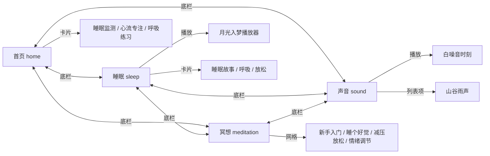

# Healing Tabs — 视觉契约分析（Phase 0b）

> 参照图来源：`04-core-tab-ui/` · 画布 **941 × 1672** · 分析日期 2026-08-29

## 全局设计 Token

| Token | 值 |
| --- | --- |
| 画布宽 | 941px |
| 画布高 | 1672px |
| 水平边距 | 36px |
| 内容宽 | 869px |
| 底栏 Y | 1548px |
| 底栏高 | 92px |
| 底栏圆角 | 32px |
| 字体族 | PingFang SC, Noto Sans CJK SC, system-ui |
| 玻璃暗色 | `rgba(22, 28, 36, 0.55)` + blur 24px |
| 玻璃亮色 | `rgba(255, 255, 255, 0.62)` + blur 24px |
| 主文字（暗底） | `#FFFFFF` |
| 次文字（暗底） | `rgba(255,255,255,0.70)` |
| 主文字（亮底） | `#2C3338` |
| 次文字（亮底） | `rgba(44,51,56,0.62)` |
| 冥想激活色 | `#E6A23C` |

## 页面导航地图



根 Tab 仅切换四屏；详情页不在 Phase 2c 范围。

---

## 1. 首页（home-tab-v2.png）

### 页面标识
- **Tab**: 首页（激活）
- **文件**: `04-core-tab-ui/home-tab-v2.png`

### 布局结构
| 区域 | Y 范围 | 说明 |
| --- | --- | --- |
| 背景 | 全屏 | 雾气松林远山 |
| 页眉 | 88–200 | 问候 + 控制组 + 头像 |
| 主内容 | 400–820 | 「此刻建议」+ 三卡横排 |
| 底栏 | 1548–1640 | 四 Tab 导航 |

### 组件清单
| 组件 | 类型 | 坐标 (x,y,w,h) | 素材 |
| --- | --- | --- | --- |
| 背景 | image | 0,0,941,1672 | `background_home.png` |
| 标题 | text | 44,104,—,48px | HTML「晚上好」 |
| 副标题 | text | 44,168,—,15px | HTML |
| 控制胶囊 | glass pill | 586,92,198,58 | mute + grid |
| 头像 | image | 838,90,64,64 | `profile_orb.png` |
| 区块标题 | text+deco | 44,414,—,22px | HTML + `recommendation_heading` |
| 推荐卡×3 | glass card | 见下 | feature_art icons |
| 底栏 | nav | 36,1548,869,92 | `nav_icons/*` |

**推荐卡坐标**（272×272，gap 18）:
- 卡1: 36, 478
- 卡2: 326, 478
- 卡3: 616, 478

### 内容清单
- 晚上好
- 愿你晚风轻拂，安然入梦。
- 此刻建议
- 睡眠监测 / 心流专注 / 呼吸练习
- 首页 / 睡眠 / 冥想 / 声音

### 颜色
- 背景：#1A2830 → #3D5560 渐变雾林
- 主文字：#FFFFFF
- 次文字：rgba(255,255,255,0.72)
- 卡片玻璃：rgba(18,24,32,0.50)
- 激活导航光晕：#D4EFDF

### 排版
| 元素 | 字号 | 字重 |
| --- | --- | --- |
| 晚上好 | 48px | 700 |
| 副标题 | 15px | 400 |
| 区块标题 | 22px | 700 |
| 卡标签 | 14px | 500 |
| 导航标签 | 12px | 400 |

### 交互状态
- **首页** Tab 激活（罗盘图标 + 圆形光晕）
- 其余 Tab 半透明灰白

### 数据模式
```ts
{ greeting, subtitle, recommendations: [{ icon, label, route }] }
```

---

## 2. 睡眠（sleep-tab-v1.png）

### 页面标识
- **Tab**: 睡眠（激活）

### 布局结构
| 区域 | Y 范围 | 说明 |
| --- | --- | --- |
| 页眉 | 88–160 | 标题 + 搜索/添加/头像 |
| Hero | 200–560 | 今晚好眠 + 月光入梦 + 播放 |
| 功能行 | 600–880 | 三卡玻璃容器 |
| 底栏 | 1548–1640 | 导航 |

### 组件清单
| 组件 | 坐标 (x,y,w,h) | 素材 |
| --- | --- | --- |
| 标题 | 44,104,—,48px | HTML「睡眠」 |
| 搜索 | 684,94,52,52 | `search_button.png` |
| 添加 | 752,94,52,52 | `add_button.png` |
| 头像 | 830,92,64,64 | `profile_orb.png` |
| 眉标 | 44,214,—,14px | HTML「今晚好眠」 |
| 主标题 | 44,248,—,54px | HTML「月光入梦」 |
| 副标题 | 44,338,—,15px | HTML |
| 播放 | 44,392,108,108 | `play_button.png` |
| 功能容器 | 36,598,869,272 | glass |
| 内卡×3 | 均分 | feature_art |
| 底栏 | 36,1548,869,92 | nav |

### 内容清单
- 睡眠 / 今晚好眠 / 月光入梦 / 睡前冥想 · 20 分钟
- 睡眠故事 / 呼吸 / 放松

### 颜色
- 主文字：#FFFFFF
- 次文字：#A0AABF
- 激活光晕：#B0A4FF
- Hero 玻璃：rgba(255,255,255,0.12)

### 排版
| 元素 | 字号 | 字重 |
| --- | --- | --- |
| 睡眠 | 48px | 700 |
| 月光入梦 | 54px | 500, letter-spacing 0.1em |
| 眉标/副标题 | 14–15px | 400 |
| 卡标签 | 15px | 500 |

### 数据模式
```ts
{ hero: { eyebrow, title, subtitle, duration }, categories: [{ icon, label }] }
```

---

## 3. 冥想（meditation-tab-v2.png）

### 页面标识
- **Tab**: 冥想（激活）

### 布局结构
| 区域 | Y 范围 | 说明 |
| --- | --- | --- |
| 页眉 | 88–160 | 标题 + 搜索 + 星形切换 |
| 引言卡 | 188–388 | 今日一句 |
| 分类区 | 404–1120 | 为心出发 + 2×2 网格 |
| 底栏（亮色） | 1548–1640 | 导航 |

### 组件清单
| 组件 | 坐标 (x,y,w,h) |
| --- | --- |
| 标题 | 44,104,—,48px |
| 搜索 | 156,108,48,48 |
| 星形切换 | 680,92,138,58 |
| 引言卡 | 36,196,869,184 |
| 引言叶 | 56,220,96,140 |
| 引言主文 | 188,248,—,26px |
| 引言副文 | 188,296,—,13px |
| 区块标题 | 44,408,—,22px |
| 网格卡×4 | 36,468 起，426×274，gap 16 |
| 底栏 light | 36,1548,869,92 |

**网格坐标**:
- 左上: 36, 468
- 右上: 478, 468
- 左下: 36, 758
- 右下: 478, 758

### 内容清单
- 冥想 / 慢一点，也没关系 / 今日一句 / 为心出发
- 新手入门 / 睡个好觉 / 减压放松 / 情绪调节

### 颜色
- 背景顶：#A7C5D9 / 底：#E1EBE2
- 主文字：#2C3338
- 激活导航：#E6A23C
- 玻璃：rgba(255,255,255,0.62)

### 排版
| 元素 | 字号 | 字重 |
| --- | --- | --- |
| 冥想 | 48px | 700 |
| 引言 | 26px | 500 |
| 网格标签 | 16px | 600 |

---

## 4. 声音（sound-tab-v1.png）

### 页面标识
- **Tab**: 声音（激活）

### 布局结构
| 区域 | Y 范围 | 说明 |
| --- | --- | --- |
| 页眉 | 88–160 | 标题 + 搜索/添加/头像 |
| Hero 卡 | 184–596 | 白噪音时刻 + 波形 + 播放 |
| 列表卡 | 612–812 | 山谷雨声 + 标签 |
| 底栏 | 1548–1640 | 导航 |

### 组件清单
| 组件 | 坐标 (x,y,w,h) |
| --- | --- |
| 标题 | 44,104,—,48px |
| 搜索 | 684,94,52,52 |
| 添加 | 752,94,52,52 |
| 头像 | 830,92,64,64 |
| Hero 卡 | 36,184,869,400 |
| Hero 标题 | 60,220,—,20px |
| 波形 | 60,480,720,48 |
| 播放 | 768,468,96,96 |
| 列表卡 | 36,612,869,188 |
| 缩略图 | 56,636,136,136 |
| 列表标题 | 216,656,—,20px |
| 列表副标题 | 216,692,—,14px |
| 标签行 | 216,728 | pills |
| 底栏 | 36,1548,869,92 |

### 内容清单
- 声音 / 白噪音时刻 / 山谷雨声 / 专注 · 45 分钟
- 自然 / 雨声 / 风声

### 颜色
- 背景：#10181D
- 主文字：#FFFFFF
- 次文字：#A0AAB2
- 激活光晕：#B2F2BB

### 数据模式
```ts
{ featured: { title, waveform }, items: [{ thumb, title, subtitle, tags[] }] }
```

---

## 验收坐标源

实现以本文档坐标为准；`layout-spec.json` 与 CSS 同步更新。叠对照默认透明度 40%。
